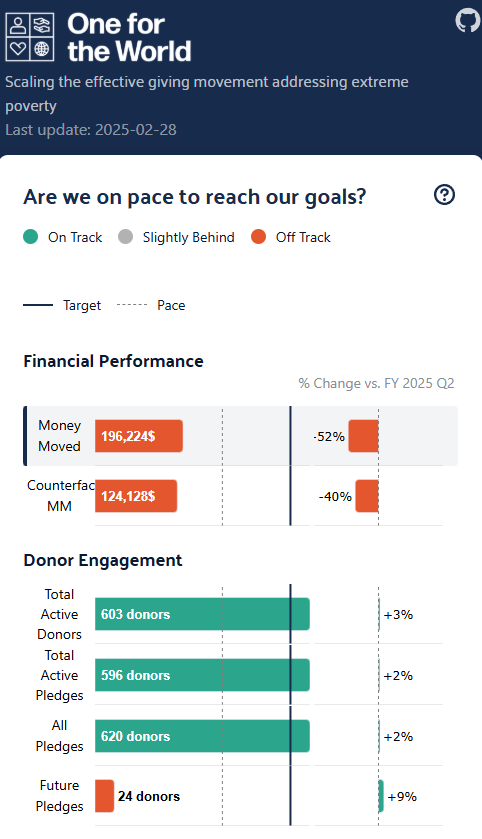

# OFTW Dashboard 📊

> A responsive data visualization dashboard designed for One for the World (OFTW) to monitor their financial and donor performance over time.

## 🔍 Preview

<table>
<tr>
<td><b>💻 Desktop</b></td>
<td><b>📱 Mobile</b></td>
</tr>
<tr>
<td></td>
<td></td>
</tr>
</table>

---

## 🧭 Project Context

This dashboard was developed as part of a data analytics challenge for the nonprofit organization One for the World (OFTW), which promotes effective giving to combat extreme poverty.

The tool allows internal stakeholders to assess how well OFTW is performing relative to its goals across multiple KPIs, including:

- 💰 Money Moved
- 📈 Donor Pledges & Engagement
- 📉 Attrition Rates
- 🔄 Recurring Revenue (ARR)

---

## 🧠 How It Works

The dashboard displays:

- **Current performance** for each metric
- Comparison vs. **target**
- Deviation from **expected pace**
- Relative change vs. **previous periods**

Users can toggle between **fiscal vs. calendar year**, **year selection**, and **quarter filtering** to dynamically adjust the benchmarking logic.

### Period Comparison Logic

- When selecting a **full year**, comparisons are made with the same period last year.
- When selecting a **specific quarter**, the metrics are compared with:
  - The same quarter last year
  - The previous quarter
  - The current quarter's progression

This enables clear temporal trend analysis and benchmarking.

---

## 🎯 Target Logic

Annual targets are defined by OFTW. Quarterly benchmarks are generated using a data-driven methodology:

- The average share of each metric per quarter was computed across all historical complete years.
- Years with incomplete or insufficient data were excluded using volume-based thresholds.
- Both **fiscal** and **calendar** proportions were computed separately to account for seasonal donor behavior.
- These percentages were applied to each metric's annual target to compute precise quarterly goals.

The full process is documented in [`notebook/02.create_target_json.ipynb`](notebook/02.create_target_json.ipynb).

---

## 🧹 Preprocessing & Data Cleaning

The initial data engineering pipeline includes:

- Currency standardization via [`00.exchange.ipynb`](notebook/00.exchange.ipynb)
- Filtering out undesired fund designations:  
  `['One for the World Discretionary Fund', 'One for the World Operating Costs']`
- Transformation of pledge & donation records into a clean, structured DataFrame:  
  [`01.create_final_dataset.ipynb`](notebook/01.create_final_dataset.ipynb)

---

## 🧩 Metrics Engine

All metric logic is encapsulated within [`utils/metrics_engine.py`](utils/metrics_engine.py).

- Metrics are structured as class-based objects (e.g., `AmountMetric`, `CountMetric`, `RateMetric`, `ARRMetric`)
- Each metric supports dynamic calculation, period comparisons, and target/pace logic
- This modular design enables **easy future extensibility** — new metrics can be added with minimal configuration

---

## 🛠️ Tech Stack

- 🐍 Python (Dash + Plotly + Pandas)
- 📦 Dockerized app
- ☁️ Deployed via Google Cloud Run
- ✨ Fully responsive design via Mantine Components (via Dash Mantine Components)

---

## 📁 Project Structure

```bash
oftw-dashboard/
├── assets/
├── constants/
├── data/
├── img_readme/
├── load_data/
├── notebook/
│   ├── 00.exchange.ipynb
│   ├── 01.create_final_dataset.ipynb
│   └── 02.create_target_json.ipynb
├── utils/
│   └── metrics_engine.py
├── .gitignore
├── app.py
├── requirements.txt
```

---

## 🙌 Author

Made with 💙 by Tanguy Surowiec  
Questions? Feel free to open an issue or reach out via the GitHub repository.

---

## 📜 License

This project is open-source and free to use under the MIT License.
